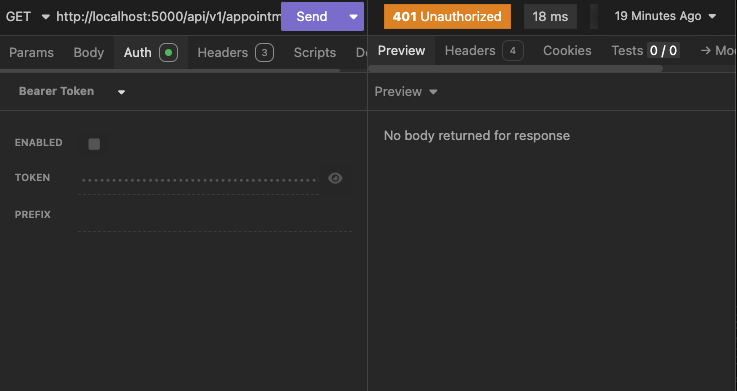

# Appointment Scheduler

This is a personal project to create a Web API for managing appointment schedules. It is designed to help me explore key concepts in service development and follow basic best practices. 

The service uses SQL Server to store appointment data and includes authentication and logging mechanisms. It assumes a client application will interact with the API for scheduling and managing appointments.

---

## Appointment Scheduling Logic

To add realism and complexity, the service enforces the following scheduling rules:

- Appointments can only be scheduled within a two-week window, starting from today.
- Appointments are always 45 minutes long, and overlapping appointments are not allowed.
- Appointments cannot be scheduled on weekends.

---

## Appointment Retrieval

The service supports retrieving appointments in the following ways:

1. **By Contact Information**: Allows customers to view/edit their own appointments.
2. **By Unique ID**: Useful for identifying specific appointments.
3. **All Appointments**: 
   - Enables clients to generate a calendar showing available slots.
   - Allows service owners to view all upcoming meetings.

---

## Logging

The project includes a custom logging mechanism to aid debugging and performance analysis. Logs are stored in the database, and examples of logged events include:

### Example Log Structure:
| Id  | LogLevel   | Message               | Timestamp           |
| --- | ---------- | --------------------- | ------------------- |
| 1   | Information | Appointment created   | 2024-12-18 15:32:10 |
| 2   | Error       | Invalid token provided| 2024-12-18 16:01:45 |

---


## Authentication

The project implements a basic **JWT-based authentication** mechanism:

- The client application sends a request to the `/token` endpoint with an API key (for testing purposes, any call generates a token).
- The JWT token must be included in subsequent requests to authenticate.
- Requests without a token return a **401 Unauthorized** response.

### Example:
- **Without token**:
  

- **With token**:
  

---

## How to Test the Code

### Prerequisites:
1. [.NET SDK](https://dotnet.microsoft.com/en-us/download)
2. [Docker](https://www.docker.com/)

### Steps:
1. **Download and run SQL Server**:
   ```bash
   docker pull mcr.microsoft.com/azure-sql-edge
   docker run -e 'ACCEPT_EULA=Y' -e 'SA_PASSWORD=YourPassword123' -p 1433:1433 -d mcr.microsoft.com/azure-sql-edge
2. **Connect to SQL Server**:
   Use **SQL Server Management Studio**, **Azure Data Studio**, or another tool to connect:
   - **Server**: `localhost,1433`
   - **Authentication**: SQL Authentication
   - **Username**: `sa`
   - **Password**: `YourPassword123`

3. **Set up the database**:
   - Create a new database:
     ```sql
     CREATE DATABASE AppointmentDB;
     ```
   - Create the `Logs` table:
     ```sql
     CREATE TABLE Logs (
         Id INT IDENTITY(1,1) PRIMARY KEY,
         LogLevel NVARCHAR(50),
         Message NVARCHAR(MAX),
         Timestamp DATETIME DEFAULT GETDATE()
     );
     ```

4. **Apply migrations**:
   ```bash
   dotnet ef migrations add CreateInitialTables
   dotnet ef database update
   ```

5. **Run the service**:
   ```bash
   dotnet run
   ```

6. **Test endpoints**:
   - Use **Postman** or another API testing tool to test endpoints.
   - Example: Retrieve all appointments:
     ```http
     GET /api/test HTTP/1.1
     ```

---

## Additional Notes

- The `appsettings.json` file contains configuration settings for the database and JWT authentication for testing purposes.
